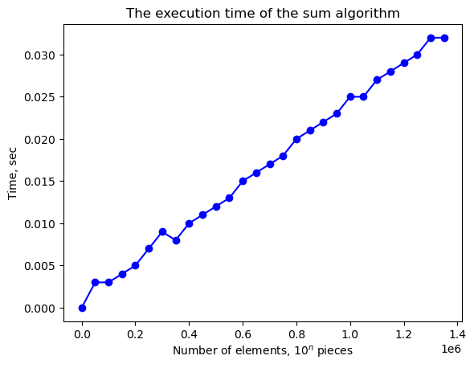
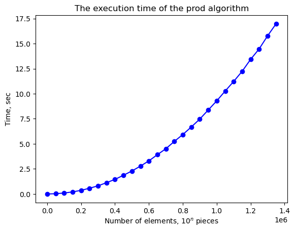
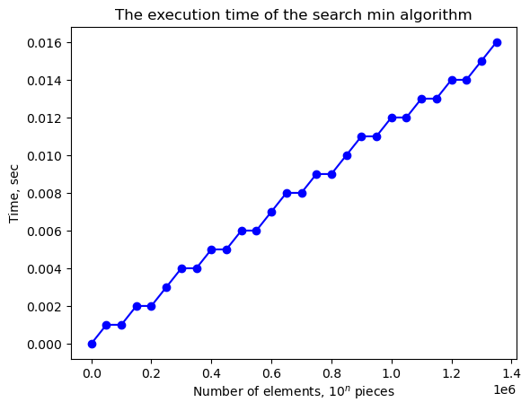
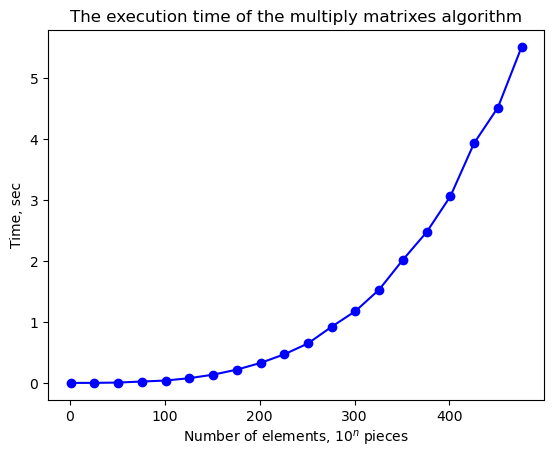

# Эмпирический анализ временной сложности алгоримов

***

Старшинов Владислав Эдуардович

ИУ10-37

Вариант 6. N = 14.

## Задания 
***

### 1.2


```python
import random, usage_time
import matplotlib.pyplot as plt

def sum_elements(v: list):
    return sum(v)

items = range(1, 10**5 * 14, 50000)
func = usage_time.get_usage_time()(sum_elements)
times = [
    func ([
        random.randint(1, 3)
        for _ in range(n)
    ])
    for n in items
]

fig = plt.plot(items, times, 'bo-')
ax = plt.gca()

plt.title('The execution time of the sum algorithm')
ax.set_xlabel('Number of elements, $10^n$ pieces')
ax.set_ylabel('Time, sec')
```


    Text(0, 0.5, 'Time, sec')


    

    


### 1.3


```python
import random, usage_time
import matplotlib.pyplot as plt

def prod_elements(v: list):
    res = 1
    for n in v:
        res *= n
    return res

items = range(1, 10**5 * 14, 50000)
func = usage_time.get_usage_time()(prod_elements)
times = [
    func ([
        random.randint(1, 3)
        for _ in range(n)
    ])
    for n in items
]

fig = plt.plot(items, times, 'bo-')
ax = plt.gca()

plt.title('The execution time of the prod algorithm')
ax.set_xlabel('Number of elements, $10^n$ pieces')
ax.set_ylabel('Time, sec')
```


    Text(0, 0.5, 'Time, sec')


    

    


### 1.4


```python
import random, usage_time
import matplotlib.pyplot as plt

def horner_method(v: list):
    res = 0
    for c in v:
        res = res * 2 + c
    return res

items = range(1, 10**5 * 14, 50000)
func = usage_time.get_usage_time()(horner_method)
times = [
    func ([
        random.randint(1, 3)
        for _ in range(n)
    ])
    for n in items
]

fig = plt.plot(items, times, 'bo-')
ax = plt.gca()

plt.title('The execution time of the horner method algorithm')
ax.set_xlabel('Number of elements, $10^n$ pieces')
ax.set_ylabel('Time, sec')
```


    Text(0, 0.5, 'Time, sec')


    

    


### 1.6


```python
import random, usage_time
import matplotlib.pyplot as plt

def search_min(v: list):
    min = 10**5 * 14
    for n in v:
        if n < min:
            min = n
    return min

items = range(1, 10**5 * 14, 50000)
func = usage_time.get_usage_time()(search_min)
times = [
    func ([
        random.randint(1, 3)
        for _ in range(n)
    ])
    for n in items
]

fig = plt.plot(items, times, 'bo-')
ax = plt.gca()

plt.title('The execution time of the search min algorithm')
ax.set_xlabel('Number of elements, $10^n$ pieces')
ax.set_ylabel('Time, sec')
```


    Text(0, 0.5, 'Time, sec')


    

    


### 2


```python
import random, usage_time
import matplotlib.pyplot as plt

def multiply_matrixes(v1: list, v2: list, n):
    res = [[0 for _ in range(n)] for _ in range(n)]
    for i in range(n):
        for j in range(n):
            for k in range(n):
                res[i][j] += v1[i][k] * v2[k][j]
    return res

items = range(1, 500, 25) # на большее не хватает оперативки ноутбука и личного терпения
func = usage_time.get_usage_time()(multiply_matrixes)
times = [
    func (
        [[random.randint(1, 3) for _ in range(n)] for _ in range(n)],
        [[random.randint(1, 3) for _ in range(n)] for _ in range(n)],
        n
    )
    for n in items
]

fig = plt.plot(items, times, 'bo-')
ax = plt.gca()

plt.title('The execution time of the multiply matrixes algorithm')
ax.set_xlabel('Number of elements, $10^n$ pieces')
ax.set_ylabel('Time, sec')
```


    Text(0, 0.5, 'Time, sec')


    

    

